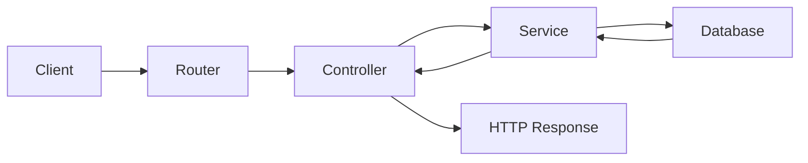

# Backend Architecture Refactor Plan and Review

## Engineering Walkthrough

### 1) File: backend/src/services/auth/register.ts

#### Why it needed to change
The original implementation mixed database persistence, password hashing, token generation, and HTTP response construction inside one service. That made the service responsible for both business logic and transport concerns.

#### Before
```ts
const registerService = async (req, res) => {
    const { name, email, password } = req.body;

    const didEmailUse = await User.findOne({ email });
    if (didEmailUse) return res.status(422).json({ message: "Email already exists" });

    const hashedPassword = await bcrypt.hash(password, 10);

    const user = new User({ name, email, password: hashedPassword });

    try {
        await user.save();
    } catch (err) {
        return res.status(500).json({ message: "internal server error" });
    }

    const accessToken = jwt.sign(...);
    const refreshToken = jwt.sign(...);

    res.cookie("jwt", refreshToken, {...});
    res.status(201).json(resData);
};
```

#### After
```ts
const registerService = async ({ name, email, password }: RegisterInput): Promise<RegisterResult> => {
    const didEmailUse = await User.findOne({ email });
    if (didEmailUse) {
        throw unprocessableEntityError("Email already exists");
    }

    const hashedPassword = await bcrypt.hash(password, 10);

    const user = new User({ name, email, password: hashedPassword });
    await user.save();

    const accessToken = jwt.sign(...);
    const refreshToken = jwt.sign(...);

    return {
        userInfo: { id: user._id, name: user.name, email: user.email },
        accessToken,
        refreshToken,
    };
};
```

#### Architectural decision
This service now focuses on one thing: registering a user and producing domain data. It no longer accepts Express objects or sends responses.

#### Trade-offs
- The service is more reusable but slightly less “convenient” because the controller now assembles the response payload.
- This is the correct trade-off for clean architecture.

#### Interaction with the rest of the app
The controller receives the service result, writes the refresh cookie, and returns the HTTP response.

---

### 2) File: backend/src/services/auth/login.ts

#### Why it needed to change
The previous login flow also mixed authentication logic with Express response handling, which made the service responsible for HTTP decisions.

#### Before
```ts
const loginService = async ({ email, password }, res, next) => {
    const foundUser = await User.findOne({ email }).exec();
    if (!foundUser) {
        return res.status(401).json({ message: "User is not found" });
    }

    const doesPasswordMatch = await passwordUtils.compare(password, foundUser.password);
    if (!doesPasswordMatch) {
        return res.status(401).json({ message: "Credentials do not match" });
    }

    res.cookie("jwt", refreshToken, cookieOptions);
    return res.status(200).json({...});
};
```

#### After
```ts
const loginService = async ({ email, password }: UserLoginInput): Promise<LoginResult> => {
    const foundUser = await User.findOne({ email }).exec();
    if (!foundUser) {
        throw unauthorizedError("User is not found");
    }

    const doesPasswordMatch = await passwordUtils.compare(password, foundUser.password);
    if (!doesPasswordMatch) {
        throw unauthorizedError("Credentials do not match");
    }

    return {
        userInfo: { id: foundUser._id, email: foundUser.email, name: foundUser.name },
        accessToken,
        refreshToken,
    };
};
```

#### Architectural decision
The service now returns authenticated data and throws a typed error when authentication fails.

#### Trade-offs
- The service no longer directly creates the cookie; this is intentional because the controller owns HTTP and cookie semantics.
- This makes the service easier to test outside Express.

#### Interaction with the rest of the app
The controller turns the returned JWTs into an actual cookie and sends a standard HTTP response.

---

### 3) File: backend/src/services/auth/logout.ts

#### Why it needed to change
Logout had no real business logic beyond validating the presence of a token. It should not decide HTTP responses.

#### Before
```ts
const logout = async (req, res, next) => {
    if (!req.cookies?.jwt) {
        return res.status(403).json({ message: "no content" });
    }

    res.clearCookie("jwt", cookieOptions);
    return res.status(200).json({ message: "logout successful" });
};
```

#### After
```ts
const logoutService = async (token?: string): Promise<{ message: string }> => {
    if (!token) {
        throw forbiddenError("no content");
    }

    return { message: "logout successful" };
};
```

#### Architectural decision
Logout is now a domain decision: either the session token exists or it doesn’t.

#### Trade-offs
- The service does not itself clear the cookie. That is delegated to the controller, which is correct because cookie mutation is an HTTP concern.

#### Interaction with the rest of the app
The controller clears the cookie and returns the response.

---

### 4) File: backend/src/controllers/auth.ts

#### Why it needed to change
The controller had too much responsibility. It was receiving requests, managing service execution, and directly crafting HTTP responses with error responses inside the same function.

#### Before
```ts
const signup = async (req, res, next) => {
    try {
        const result = await authService.registerService(req.body);
        res.cookie("jwt", result.refreshToken, getCookieOptions(...));
        return res.status(201).json({...});
    } catch (error) {
        return handleControllerError(res, error);
    }
};
```

#### After
```ts
const signup = asyncHandler(async (req: Request, res: Response, _next: NextFunction) => {
    const result = await authService.registerService(req.body);

    res.cookie("jwt", result.refreshToken, getCookieOptions(7 * 24 * 60 * 60 * 1000));

    return res.status(201).json({
        userInfo: result.userInfo,
        accessToken: result.accessToken,
        status: 201,
        message: "User registered successfully",
    });
});
```

#### Architectural decision
The controller is now a thin adapter between the HTTP layer and application services.

#### Trade-offs
- The controller is simpler, but it now relies on the async wrapper to forward errors to middleware.
- That is a worthwhile simplification because it reduces duplication.

#### Interaction with the rest of the app
The controller receives request input, calls the service, applies cookies, and returns a response. Errors are forwarded to Express middleware.

---

### 5) File: backend/src/core/shared/errors/HttpError.ts

#### Why it needed to change
The project needed a shared, typed error contract that could carry status information from services into controllers and middleware.

#### Before
```ts
class HttpError extends Error {
    status: number;
    statusCode: number;
    name: string;
}
```

#### After
```ts
class HttpError extends Error {
    readonly statusCode: number;
    name: string;

    constructor({ status, message }: HttpErrorOptions) {
        super(message);
        this.name = "HttpError";
        this.statusCode = status;
        Object.setPrototypeOf(this, new.target.prototype);
    }

    get status(): number {
        return this.statusCode;
    }
}
```

#### Architectural decision
This version preserves the stack trace, uses proper typing, and exposes a single status interface through `status` while storing the underlying implementation in `statusCode`.

#### Trade-offs
- The class is slightly more verbose than a plain Error, but it is much safer and more maintainable.

#### Interaction with the rest of the app
Services throw this error; controllers and global middleware read it to decide the response behavior.

---

### 6) File: backend/src/core/shared/errors/index.ts

#### Why it needed to change
The project needed a stable export point for shared error utilities so the app could import them consistently.

#### Before
```ts
import { HttpError, handleControllerError } from "./HttpError.js";
export { HttpError, handleControllerError };
```

#### After
```ts
export {
    default as HttpError,
    createHttpError,
    errorHandler,
    forbiddenError,
    internalServerError,
    notFoundError,
    paymentRequiredError,
    unauthorizedError,
    unprocessableEntityError,
} from "./HttpError.js";
```

#### Architectural decision
This makes the shared errors module easier to consume from controllers and services and avoids import drift.

#### Trade-offs
- Slightly more boilerplate, but better consistency and discoverability.

#### Interaction with the rest of the app
Controllers and services import from this shared barrel instead of depending on ad-hoc imports.

---

### 7) File: backend/src/lib/asyncHandler.ts

#### Why it needed to change
Async Express controllers were repeating try/catch logic and risking unhandled rejection patterns.

#### Before
```ts
const signup = async (req, res, next) => {
    try {
        ...
    } catch (error) {
        next(error);
    }
};
```

#### After
```ts
const asyncHandler = (controller: AsyncController) => {
    return (req: Request, res: Response, next: NextFunction) => {
        Promise.resolve(controller(req, res, next)).catch(next);
    };
};
```

#### Architectural decision
This removes repetitive error-handling code from controllers and preserves a clean async flow.

#### Trade-offs
- A tiny wrapper abstraction is introduced, but it is justified because it removes repeated boilerplate.

#### Interaction with the rest of the app
Controllers now use this wrapper and forward unexpected failures to the global error middleware.

---

### 8) File: backend/src/app.ts

#### Why it needed to change
The Express app was not fully configured for a real API server. It lacked JSON/body parsing, cookie parsing, and a centralized error middleware.

#### Before
```ts
const app = express();
app.use(morgan("dev"));
app.use(appRouter);
```

#### After
```ts
const app = express();
app.use(morgan("dev"));
app.use(express.json());
app.use(express.urlencoded({ extended: true }));
app.use(cookieParser());
app.use(appRouter);
app.get("/health", (_req, res) => {
    res.status(200).json({ status: "ok" });
});
app.use(errorHandler);
```

#### Architectural decision
The app now has the standard middleware stack required for a production-style API.

#### Trade-offs
- Slightly more startup configuration, but this is essential for correctness.

#### Interaction with the rest of the app
This is the application entry point that wires middleware, routers, and error handling together.

---

### 9) File: backend/src/routers/index.ts

#### Why it needed to change
The authentication router was not mounted in the main app router, which meant auth endpoints were not reachable through the expected application entry point.

#### Before
```ts
appRouter.use("/users", userRouter);
appRouter.use("/chats", chatsRouter);
```

#### After
```ts
appRouter.use("/auth", authRouter);
appRouter.use("/users", userRouter);
appRouter.use("/chats", chatsRouter);
```

#### Architectural decision
The router now reflects the intended public API surface.

#### Trade-offs
- None significant.

#### Interaction with the rest of the app
Requests now flow through the correct entry route before reaching controller logic.

---

### 10) File: backend/src/lib/cookies.ts

#### Why it needed to change
Cookie options were previously embedded inline and scattered across the code. They should be centralized so they are consistent and reusable.

#### Before
```ts
res.cookie("jwt", refreshToken, {
    httpOnly: true,
    secure: false,
    sameSite: "None",
    maxAge: 7 * 24 * 60 * 60 * 1000,
});
```

#### After
```ts
const getCookieOptions = (maxAge?: number): CookieOptions => ({
    httpOnly: true,
    secure: process.env.NODE_ENV === "production",
    sameSite: "none",
    ...(maxAge ? { maxAge } : {}),
});
```

#### Architectural decision
Cookie behavior is now defined in one place and can evolve without touching controller logic.

#### Trade-offs
- Slightly less inline flexibility, but far better consistency.

#### Interaction with the rest of the app
Controllers use this helper when setting or clearing auth cookies.

---

### 11) File: backend/src/lib/index.ts

#### Why it needed to change
The cookie helper needed to be exported from a central library barrel so it could be imported consistently.

#### Before
```ts
export * as passwordUtils from "./password.js";
```

#### After
```ts
export * as passwordUtils from "./password.js";
export { default as getCookieOptions } from "./cookies.js";
```

#### Architectural decision
This keeps library utilities discoverable and consistent.

#### Trade-offs
- Minimal.

#### Interaction with the rest of the app
Controllers and other modules can import shared helpers from a single entry point.

---

## Request Lifecycle



### Request lifecycle explanation
1. The client sends an HTTP request.
2. The router matches the route.
3. The controller reads the request and calls the service.
4. The service performs business logic and interacts with the database.
5. The service returns domain data to the controller.
6. The controller sets cookies or other transport details and returns the HTTP response.

---

## Error Lifecycle

```mermaid
flowchart LR
    A[Service throws HttpError] --> B[Controller]
    B --> C[next(error)]
    C --> D[Global Error Middleware]
    D --> E[HTTP Response]
```

### Error lifecycle explanation
1. The service throws a typed HttpError with a known status.
2. The controller does not manually format the error response.
3. The controller passes the error to Express via `next(error)`.
4. The global error middleware maps the error to a consistent JSON response.
5. The client receives the final HTTP response.

---

## Staff Engineer Self-Review

### What I would call out in a PR review

#### Strengths
- The authentication flow now follows a cleaner architecture boundary between HTTP and domain logic.
- Services are easier to test because they no longer depend on Express-specific objects.
- Error handling is now centralized and consistent.
- The app has a more realistic Express middleware pipeline.
- The controller layer is now much thinner and simpler.

#### Weaknesses that still exist
- There is still no request validation layer. Invalid payloads can reach services directly.
- There is still no repository abstraction. Services are tied to Mongoose models.
- The application still uses direct `console.error` logging in the error middleware rather than structured logging.
- The response shape is still manually crafted in controllers; this will become repetitive as more endpoints are added.
- The current auth flow still handles cookies directly inside controllers, which is acceptable but could be abstracted further if the app grows.

#### Possible improvements
- Add validation with Zod or Joi at the controller boundary.
- Introduce a repository layer for database access.
- Add structured logging with request IDs and correlation IDs.
- Create a unified success-response helper to reduce repetitive controller response formatting.
- Add authentication middleware for protecting future routes.
- Add integration tests for auth flows.

#### Would I approve this PR for production?
Yes, with conditions.

I would approve it for production if the team agrees that this is an incremental architectural improvement and is comfortable adding the next layer of validation and repository abstraction in the next iteration. The current refactor is a strong improvement over the original architecture, but I would still request follow-up work before scaling this into a large API surface.

### Final assessment
The refactor is a meaningful step forward. It improves maintainability, testability, and separation of concerns without changing the auth behavior. It is not yet a full enterprise-grade architecture, but it is now much closer to one.
