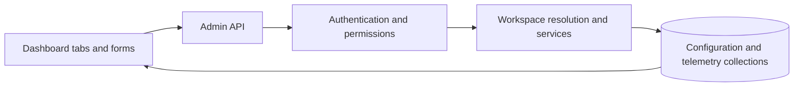
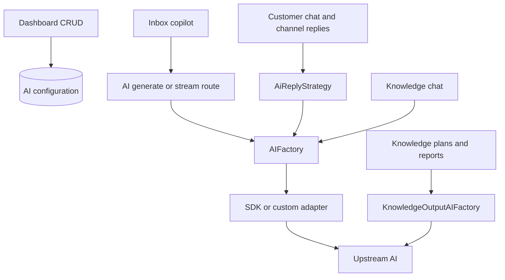
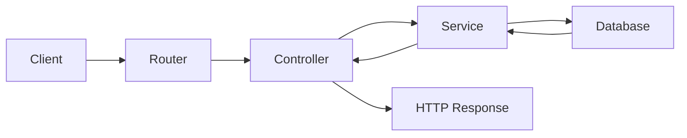

# Dashboard AI Management: Business and Code Walkthrough

## Implementation update — 2026-09-08

The source review below is preserved as the **pre-implementation baseline**. Its statements that dashboard settings are persistence-only are superseded for customer replies and Inbox AI suggestions by the implementation described here.

- **Provider control:** MongoDB enablement is checked on each call through `AIFactory`, including streaming and long-lived handles. `KnowledgeOutputAIFactory` also checks its provider switch. The registry now includes the existing Vercel, OpenAI, Anthropic, and custom connections. Global provider/model mutations require both the relevant AI permission and `business.manage`.
- **Workspace assignment:** `/api/admin/ai-management/runtime` GET/PATCH exposes the default AI-agent assignment. PATCH requires `ai.agents.manage`; selection is restricted to an enabled agent in the authorized workspace. Assign it under **AI Management → Agents**. Workspaces without an assignment retain environment defaults. A missing, disabled, or inaccessible assigned agent never falls back to an environment-selected agent.
- **Agent settings:** customer replies resolve the current agent, shared workspace role, primary/fallback models, system prompt, channels, temperature, output limit, and timeout. The form includes all of these settings and loads real role choices. Explicit zero temperature is preserved. Model output limits cap each attempt; credentials and endpoints stay server-side.
- **Context capabilities:** `knowledge-search` requires `knowledge.use`; `conversation-context` requires `inbox.view`. These gates run before loading knowledge or prior conversation messages. They are server-invoked context capabilities, not arbitrary autonomous action tools. Unknown capability names are rejected on save. Prompt links do not execute actions.
- **Routing:** an active agent policy takes precedence over one workspace-wide policy, then the agent's ordered model list. Priority preserves saved order; round robin uses a persistent atomic cursor; least-used/latency use runtime telemetry from the last 24 hours; quota-aware ordering considers applicable budget pressure. Multiple applicable active policies fail explicitly. Disabled candidates are skipped only for another assigned candidate; broken references are errors. Managed calls disable hidden environment fallbacks and SDK retries.
- **Quotas:** each provider attempt reserves all applicable workspace/agent/provider/model policies using atomic MongoDB predicates. Zero request/token limits mean unlimited; concurrency must be positive. UTC minute/day/month windows have unique identities. Failed admission compensates earlier reservations, and settlement is idempotent. Input bytes plus an overhead margin and maximum output form a conservative token reservation; SDK-reported usage reconciles it. Unreported or interrupted calls retain the conservative charge. Leases expire after the bounded request timeout plus a grace period. These are AI execution budgets; existing subscription accounting remains separate.
- **Inbox streaming:** `/api/ai/generate` and `/api/ai/stream` now require authentication and `inbox.view`. The Inbox supplies `options.threadId` and `options.systemSlug`; the backend reads the actual workspace conversation and ignores client-supplied agent overrides. Managed workspaces require a conversation. Streaming keeps its reservation until the adapter finishes and never retries after response headers are committed. This is an intentional security change to the previously unauthenticated endpoints.
- **Telemetry:** new customer/Inbox attempts are marked `source: runtime`. Overview and request logs exclude seeded/demo records; analytics use the last 30 days. Usage that a provider does not report is displayed as unknown instead of a claimed zero. No prompt content or upstream error payload is added to request logs. Logs refresh through the existing Refresh action.

### Boundaries and operation

1. Create a workspace role in Settings → Security, register the required model as a business administrator, then create and assign an AI agent.
2. Set its prompt, allowed channels, context capabilities, output cap, and timeout. Add an ordered routing policy and targeted quotas as needed.
3. Saved changes govern new executions; in-flight requests may finish with their captured settings. No frontend Redux state is trusted to authorize runtime behavior.
4. Generic knowledge Q&A, file transcription, and structured plans/reports retain their task-specific model/prompt configuration. Factory-based knowledge generation obeys provider availability, but customer-agent routing/quotas are not applied to those separate workloads. Direct transcription adapters are outside the customer-agent pipeline.
5. Upstream gateway connections remain independent of direct supplier adapters. Disabling a direct Google connection does not reconfigure which suppliers Vercel or OpenRouter can use internally.
6. Token reservations are conservative estimates, not vendor-specific tokenization or a guarantee about hidden upstream billing. No live-provider, browser-session, or production-database verification was performed.

Validation and feature-by-feature completion are recorded in [whats-done.md](../whats-done.md). Additive Mongoose fields store the default agent, routing cursor, runtime provenance, and quota window/leases; no production data was migrated or seeded during implementation.

---

## Historical source review

Reviewed: 2026-09-08. Scope: the current React frontend and Express/Mongoose backend in this workspace. This is a source-code review, not a live database audit or a test of upstream credentials. Model names describe repository configuration, not verified vendor availability.

The dashboard is a working configuration and reporting surface, but its database settings do not yet control live AI execution. Runtime requests select providers/models through code, request options, and environment variables. Disabling a provider here does not currently stop its runtime adapter. This guide distinguishes implemented behavior from intended functionality.

The pre-existing backend refactor document is preserved at the end as historical material.

## 1. Business purpose and architecture

The intended business workflow is: register AI suppliers and models, configure specialized assistants, decide fallback behavior, set budgets, and monitor traffic, failures, tokens, and costs for each customer workspace.

| Concept | Business meaning | Storage and scope |
|---|---|---|
| Provider | Supplier or gateway for AI inference | `AIProvider`, global |
| Model | Specific engine offered by a supplier | `AIModel`, global; references provider |
| Agent | Named assistant with instructions and intended permissions | `AIAgent`, workspace-scoped |
| Routing policy | Candidate models and selection/retry settings | `AIRoutingPolicy`, workspace-scoped |
| Quota policy | Request/token/concurrency budget | `AIQuotaPolicy`, workspace-scoped |
| Request log | Recorded execution and outcome | `AIRequestLog`, workspace ID |
| Token log | Separate usage/cost record used by legacy analytics | `TokenLog`, workspace slug |

An `AIAgent` record is not a running worker. Saving tools or channels on it does not implement tools or launch a process. The reply strategy called `agent` is the human-agent reply path, distinct from this AI-agent collection.



## 2. Browser entry, tabs, loading, and filters

Sources: [routes](../frontend/src/router/dashboard.tsx), [page](../frontend/src/pages/dashboard/AIManagement.tsx), [context](../frontend/src/features/ai-management/AIManagementContext.tsx), [API functions](../frontend/src/services/llms/aiManagement.ts), [HTTP client](../frontend/src/api/index.ts).

1. `/dashboard/ai-management` runs under `ProtectedRoute` and redirects to `overview`.
2. Seven tabs exist: Overview, Providers, Models, Agents, Routing, Quotas, Request Logs.
3. The child `analytics` route redirects to overview. `/dashboard/token-management` redirects to AI management.
4. `AIManagementProvider` reads `state.workspace.active`. Its slug becomes `system_slug` for workspace-scoped requests. The fallback header label `Global` does not make those endpoints return all workspaces.
5. On mount or workspace change, `reload()` fetches overview, providers, models, agents, routing, quotas, logs, and analytics using `Promise.all`.
6. The page displays a loading spinner, an error alert if loading fails, or the nested view. Refresh and successful CRUD operations reload data.
7. There is no polling/WebSocket subscription making request logs automatically live.

The Axios client uses `VITE_API_URL` or its hosted `/api` default, sends cookies, and adds stored tokens to `Authorization` and `X-Authorization`.

Search matches lowercase `JSON.stringify(item)`. Provider filtering uses `provider`, `providerId.code`, or `code`. Status filtering uses `status`, then `health`, then enabled/disabled. Filtering is client-side, over loaded lists. Overview aggregates and embedded token analytics do not obey those filters. Agents/routing have no direct provider field, so selecting a provider can hide those records. Health takes precedence over enabled status for providers.

**Limitations:** all eight requests must succeed before their results are assigned. A user with `ai.view` but without `ai.analytics.view` can therefore see a whole-page failure. Controls are not individually permission-gated. Workspace requests have no stale-response guard, so rapid workspace switching can race.

The router imports dedicated `views/OverviewView.tsx`, `views/ProvidersView.tsx`, and `views/QuotasView.tsx`. Other tabs use `AIManagementViews.tsx`. Duplicate exports in that shared file are not the routed versions of those three views.

## 3. API lifecycle and access control

Sources: [app](src/app.ts), [admin router](src/routers/workspace.ts), [controllers](src/controllers/aiManagement.ts), [services](src/services/aiManagement.ts), [authentication](src/middlewares/authenticate.middleware.ts), [permissions](src/middlewares/requirePermission.middleware.ts).

1. The app mounts its main router at `/api` and the root, and the router mounts admin routes at `/admin`.
2. Admin middleware authenticates cookies or authorization headers and populates `res.locals.user`.
3. Each AI-management route requires the permission below.
4. Controllers read `req.body`, route ID, and optional query `system_slug`, then call a service.
5. Workspace services resolve the slug or `user.workspaceId`. Missing workspace gives 404. Non-super-admin users must belong to that workspace or receive 403. Super admins still need endpoint permissions.
6. Results use `{ success: true, data }`: creates return 201; reads, updates, and deletes return 200. Async errors pass to error middleware.

Prefix below: `/api/admin/ai-management` (also mounted without `/api`).

| Endpoint suffix | Methods | Scope | Permission |
|---|---|---|---|
| `/overview` | GET | Workspace metrics plus global counts | `ai.view` |
| `/providers` | GET | Global | `ai.view` |
| `/providers/:id` | PATCH | Global | `ai.providers.manage` |
| `/models` | GET | Global | `ai.view` |
| `/models`, `/models/:id` | POST; PATCH, DELETE | Global | `ai.models.manage` |
| `/agents` | GET | Workspace | `ai.view` |
| `/agents`, `/agents/:id` | POST; PATCH, DELETE | Workspace | `ai.agents.manage` |
| `/routing` | GET | Workspace | `ai.view` |
| `/routing`, `/routing/:id` | POST; PATCH, DELETE | Workspace | `ai.routing.manage` |
| `/quotas` | GET | Workspace | `ai.view` |
| `/quotas`, `/quotas/:id` | POST; PATCH, DELETE | Workspace | `ai.quotas.manage` |
| `/logs`, `/analytics` | GET | Workspace | `ai.analytics.view` |

No provider create/delete/test endpoint or log-editing endpoint exists here. Provider/model services do not resolve workspace access. Their manage permissions are classified as workspace permissions in [the registry](src/core/security/permission.registry.ts), although these mutations affect global records. That is an observed authorization boundary that needs a deliberate business decision.

## 4. Overview: what each metric means

Source: [routed overview](../frontend/src/features/ai-management/views/OverviewView.tsx), `getAIOverviewService`, and `getAIAnalyticsService`.

**Business use:** inspect recorded traffic, reliability, usage, available resources, and budgets approaching limits.

1. The service ensures provider records exist.
2. It counts globally enabled providers/models and workspace-enabled agents.
3. It counts workspace request logs; success includes both `success` and `fallback`.
4. It sums total tokens/fallback attempts and averages latency.
5. The UI displays requests, success rate, tokens, latency, agents, models, providers, and quota-risk cards.
6. It adds daily traffic bars, execution outcomes, provider performance, agent fleet, routing summaries, quota usage, recent executions, and separate token analytics.

```ts
success_rate = requests ? Math.round(successful / requests * 1000) / 10 : 0;
quotaRisk = quotas.filter(q => q.tokenLimit && q.usedTokens / q.tokenLimit >= 0.7).length;
```

Analytics groups `AIRequestLog` by provider (requests, tokens, average latency, estimated cost), date (requests/failures), and status. Queries include all matching workspace records. The chart says “last 30 days,” but the service has no date filter. Demo data happens to cover approximately that period. Quota risk includes disabled policies. Enabled providers are not necessarily configured or healthy.

## 5. Providers: registration, credentials, and enablement

Sources: [provider view](../frontend/src/features/ai-management/views/ProvidersView.tsx), [registry](src/core/ai-management/provider.registry.ts), [schema](src/models/AIProvider.ts), [compatible adapters](src/core/ai-gateway/providers/compatible.factories.ts).

**Business steps:** inspect credential presence, health, model count, and priority; toggle a provider's stored availability.

1. `ensureProviders()` upserts nine definitions with `$setOnInsert`; new records default to enabled and priority 100.
2. Listing sorts by ascending priority and returns safe display fields, including configured, health, last check/error, and base URL.
3. `configured` only checks nonempty environment variables. It does not validate the key with the supplier.
4. A switch PATCHes `{ enabled: !provider.enabled }`; the service also accepts priority, but the UI only displays priority.
5. The context replaces the provider locally; the overview count is not directly refetched by this toggle.

| Provider | Required environment variables | Runtime default model in source |
|---|---|---|
| Google Gemini | `GOOGLE_GENERATIVE_AI_API_KEY` | `gemini-3.6-flash` |
| OpenRouter | `OPENROUTER_API_KEY` | `openrouter/free` |
| Cohere | `COHERE_API_KEY` | `command-r7b-12-2024` |
| Mistral | `MISTRAL_API_KEY` | `mistral-small-latest` |
| NVIDIA NIM | `NVIDIA_API_KEY` | `meta/llama-3.1-8b-instruct` |
| Cloudflare Workers AI | `CLOUDFLARE_API_TOKEN`, `CLOUDFLARE_ACCOUNT_ID` | `@cf/meta/llama-3.1-8b-instruct-fp8-fast` |
| SambaNova | `SAMBANOVA_API_KEY` | `Meta-Llama-3.3-70B-Instruct` |
| Ollama Cloud | `OLLAMA_API_KEY` | `gpt-oss:20b` |
| OrcaRouter | `ORCAROUTER_API_KEY` | `orcarouter/free` |

The eight compatible adapters use `createOpenAI` with supplier-specific base URLs. Google uses its SDK factory. Runtime registration additionally includes `openai`, `anthropic`, `vercel`, and `custom`, absent from this dashboard registry.

Additional runtime configuration: `OPENAI_API_KEY` (legacy `OPEN_AI_SECRET_KEY` fallback), `ANTHROPIC_API_KEY`, `AI_GATEWAY_API_KEY`, and `CUSTOM_AI_API_URL`. The OpenAI resolver checks key format/placeholders locally. The custom adapter defaults to `http://localhost:5001/api/v1/ai` and proxies generate/stream requests.

**Current boundary:** runtime adapters never read provider enabled/priority/health/base URL from MongoDB. No live health-check updater was found; health defaults to unknown and the seeder writes synthetic healthy/degraded values. Ollama's catalog URL is `https://ollama.com/api`, while its adapter uses `https://ollama.com/v1`. Stored URL edits would not change that adapter. No credential editing, rotation, or test button is implemented here.

## 6. Models: catalog CRUD

Sources: [shared views](../frontend/src/features/ai-management/AIManagementViews.tsx), [CRUD](../frontend/src/components/dashboard/AIEntityCrud.tsx), [model schema](src/models/AIModel.ts).

**Business example:** register a supplier model with a staff-friendly name and recorded context/output capacity so assistants can reference it.

1. GET populates provider code/name/health and sorts by priority then display name.
2. Create/Edit collects display name, external ID, provider, alias, context window, max output tokens, and enabled.
3. Numeric inputs are converted before POST/PATCH.
4. `saveAIModelService` validates provider ObjectId and existence, then creates/updates with Mongoose validation.
5. `(providerId, externalId)` is unique. Alias is indexed, not unique.
6. Delete removes the document; successful changes reload the page data.

The schema also supports priority and text/vision/tools/streaming/reasoning capabilities, which the form does not expose. A catalog entry does not install or test a model. Runtime selection uses request/environment defaults, not this collection. Deletion has no dependency cleanup, so references from agents/routing can become broken.

## 7. Agents: identity, prompt, roles, and model assignments

Source: [agent schema](src/models/AIAgent.ts), `AgentsView`, `AIEntityCrud`, and `saveAIAgentService`.

**Intended business use:** create specialized assistants, assign permissions through shared roles, and select their instructions, channels, tools, and primary/fallback models.

Stored fields include workspace, required security role/name/slug/system prompt, description, primary/fallback model IDs, channels, tools, temperature (default 0.35; range 0–2), max output (1200), timeout (45000ms; minimum 1000), and enabled. Slug is unique per workspace.

1. Listing populates role and primary model for the cards.
2. The form exposes name, slug, role, primary model, description, timeout, and enabled.
3. Saving resolves workspace and validates that the role belongs to it or is global (`workspaceId: null`).
4. The service normalizes slug from `input.slug || input.name`, forces workspace ID, and creates/updates.
5. Update/delete queries include both ID and workspace ID.

**Confirmed creation defect:** the schema requires `systemPrompt`, but the form omits it. A new agent cannot normally be created through this form. Existing records can retain their stored prompt when edited. Role choices come from roles on existing agents instead of a role-directory request, so an empty workspace has no role choices.

The form also omits fallback models, channels, tools, temperature, and output limits. Model references are not validated for existence as thoroughly as routing model references. These are persistence features: no reviewed runtime path reads `AIAgent` to select instructions/models or execute its tools. A role reference alone does not enforce tool permissions.

## 8. Routing: saved selection and fallback policies

Source: [routing schema](src/models/AIRoutingPolicy.ts), `RoutingView`, `saveAIRoutingService`.

| Strategy | Intended business behavior; not implemented by these policies yet |
|---|---|
| `priority` | Prefer ranked models, then fallback |
| `round_robin` | Rotate requests among candidates |
| `least_used` | Prefer lower-usage candidates |
| `lowest_latency` | Prefer faster measured candidates |
| `quota_aware` | Prefer candidates with remaining budget |

1. Create a name, select agent/strategy/models, and set retries, timeout, enabled.
2. Form data supplies checked `modelIds`.
3. Service requires at least one model, validates IDs, deduplicates, and verifies all models exist.
4. It stores a workspace policy with a unique workspace/name pair.
5. Reads populate agent/models. Cards label first model Primary and later models Fallback 1, 2, etc.

Checkbox submission follows rendered model order, not click order. There is no reorder control, although the helper text says first selected is primary. Editing/saving can therefore change an existing order to catalog order. The service does not verify that the policy's agent belongs to the workspace.

No runtime consumer of `AIRoutingPolicy` was found. Real Vercel fallback currently comes from environment settings, independently of these policies.

## 9. Quotas: budgets and current enforcement limits

Sources: [quota view](../frontend/src/features/ai-management/views/QuotasView.tsx), [schema](src/models/AIQuotaPolicy.ts), `saveAIQuotaService`.

**Business example:** record a daily workspace budget, a tighter per-agent budget, or provider/model usage limits.

1. Create/Edit collects name, scope (`workspace`, `agent`, `provider`, `model`), period (`minute`, `day`, `month`), request/token/concurrency limits, and enabled.
2. Service forces workspace and strips client-supplied used-request/used-token counters.
3. Schema additionally stores scope target `scopeId`, usage counters, and `resetAt`; names are unique per workspace.
4. Cards display token/request bars, concurrency, period, and reset countdown.
5. Percentages cap at 100%; warning starts at 70% and danger at 90%.

No runtime policy admission check, counter increment, reset worker, or distributed concurrency lease using `AIQuotaPolicy` was found. The form does not expose `scopeId`, so a non-workspace policy cannot select its actual target there. Zero-limit enforcement semantics are undefined; the UI displays zero percent. Countdown text does not reset usage.

Separate mechanisms exist: public rate-limit middleware, subscription-plan quota definitions/`UsageCounter`, and `withAiReplySlot`, a process-local customer-reply concurrency limit from `CHAT_AI_MAX_CONCURRENCY` (default 20). Vercel also receives customer-chat quota entity metadata. None synchronizes or proves enforcement of these dashboard policies.

## 10. Request logs and token insights: separate datasets

Sources: [request schema](src/models/AIRequestLog.ts), [token service](src/services/tokenLog.ts), [token controller](src/controllers/tokenLog.ts), [insights component](../frontend/src/components/dashboard/AITokenInsights.tsx).

### Request-log flow

1. GET logs resolves workspace, sorts newest first, and limits results to 200.
2. The tab applies local filters and shows provider, model, date, total tokens, latency, and status.
3. Stored fields also support agent, generate/stream type, prompt/completion counts, HTTP/error details, fallback attempts, estimated cost, and unique correlation ID.
4. Overview/analytics aggregate all workspace records, so totals may exceed the visible 200.

There is no detail drawer, export, server filtering, or pagination here. “Live execution telemetry” is a label, not an automatic streaming subscription.

### Embedded token analytics

`AITokenInsights` separately fetches `/admin/analytics/tokens?system_slug=...`. `/admin/tokens` is an alias; `/admin/analytics/tokens/logs/:apiKeyId` provides paginated key records, but these cards do not drill into them.

| Mode | What it shows |
|---|---|
| Overview/analytics | Total/input/output tokens, cost, latency, generation rate, traffic sources, first six model distribution rows |
| Quota | Tracked tokens, estimated spend, cost per 1000, requests |
| Logs | API-key identifiers, provider, token and request counts; no secret values |

The service loads `TokenLog` records and groups them by key, thread, agent name, model, and source type. It sums stored cost rather than querying a billing provider. Tokens/sec divides total input-plus-output tokens by duration, not output tokens alone. Model grouping uses model name alone and can combine providers. Its success calculation treats every non-fallback record as successful.

**Important findings:** source searches found seeder writes but no live inference writer for either `AIRequestLog` or `TokenLog`. Provider wrappers return text/pipe streams without persisting SDK usage. These are database-backed views, not yet verified live accounting. There is no reconciliation pipeline between the collections; totals can disagree.

Token analytics also lacks the workspace ownership and AI permission checks used by AI-management services: supplied slug is trusted; omitted slug or `all` queries all records. API-key details are not workspace-scoped by the controller/service. Admin authentication alone does not fix this isolation gap.

The insights component swallows errors and may show a permanent spinner. It fetches on workspace change/mount, not directly through context reload (layout remounts can trigger a fetch).

## 11. Actual AI execution and provider integration

Sources: [factory](src/core/ai-gateway/ai-gateway.factory.ts), [routes](src/core/ai-gateway/ai.route.ts), [schemas](src/core/ai-gateway/ai.lib.ts), [controller](src/core/ai-gateway/ai.controller.ts), [unified adapter](src/core/ai-gateway/providers/unified.provider.ts), [Vercel adapter](src/core/ai-gateway/providers/vercel-gateway.provider.ts).



No arrow connects catalog settings to runtime selection because that connection is missing today.

1. `/api/ai/generate` accepts string/message-array `prompt`; `/api/ai/stream` accepts messages. Provider defaults to `vercel`.
2. Zod validates payloads. Stream temperature is constrained to 0–2 with positive maxTokens; generate validation is looser. Options allow additional properties.
3. Controller selects an in-memory registered adapter through `AIFactory.getProvider` without loading workspace/agent/policy/quota records.
4. Unified adapter passes prompt/messages, system prompt, temperature (default 0.7), and optional max output to SDK `generateText`/`streamText`.
5. Generate returns `{ success: true, text }`; streaming pipes text. The custom adapter forwards its upstream stream, which may have SSE framing.

The direct gateway router is separately mounted from admin authentication. The reviewed app/router wiring applies payload validation but no authentication, permission, or rate-limit middleware to these direct endpoints. Sending browser credentials does not itself enforce access.

### Vercel's implemented fallback settings

The adapter requires `AI_GATEWAY_API_KEY`. Primary selection is `options.model`, then `CHAT_AI_MODEL`, then `google/gemini-3.6-flash`. Fallbacks come from comma-separated `CHAT_AI_FALLBACK_MODELS`, defaulting to `anthropic/claude-sonnet-4.6,openai/gpt-5.4-mini`, excluding the primary.

It uses temperature 0.35 unless overridden, max output from options or `CHAT_AI_MAX_OUTPUT_TOKENS` (1200), retry count 2, and `CHAT_AI_TIMEOUT_MS` (45000). It sends gateway fallback models, automatic caching, customer-chat tags, and optional user/quota entity metadata. This delegates fallback to the upstream gateway; it does not execute dashboard routing strategies.

## 12. Integrations with the rest of the product

### A. Inbox copilot

Sources: [Inbox](../frontend/src/pages/dashboard/Inbox.tsx), [hook](../frontend/src/hooks/useAIGateway.ts), [client](../frontend/src/services/llms/aiGateway.ts).

1. Inbox initializes `useAIGateway` with Vercel.
2. `suggestReply` maps visitor/user messages to user role and other messages to assistant role.
3. It provides customer-support instructions unless custom instructions are supplied.
4. Generate or stream calls the direct gateway; streaming accumulates Axios progress chunks and updates loading/error state.
5. It produces a suggested reply. It does not load an `AIAgent` or its role/tool permissions.

### B. Website/customer chat and business prompt configuration

Sources: [public chat](src/services/publicChat.ts), [reply service](src/services/reply.ts), [strategy](src/core/replies/ai-reply.strategy.ts), [reply limits](src/core/replies/ai-reply.policy.ts), [AIConfig service](src/services/aiConfig.ts).

1. Public chat stores the inbound visitor message and invokes `sendReply(type: "ai")`.
2. `AiReplyStrategy` loads it plus up to nine earlier messages, restores chronological order, and bounds history by `CHAT_AI_MAX_HISTORY_CHARS` (24000 default).
3. Provider comes from input or `DEFAULT_AI_PROVIDER`, normally Vercel.
4. Unless an explicit system prompt was supplied, it loads separate workspace `AIConfig` and ready `KnowledgeSource` records.
5. Instructions include assistant/company identity, tone, pricing/language/contact rules, support contacts, and action links. Those links are prompt text, not executable tools.
6. It considers 12 recent ready sources, ranks keyword matches, selects five, and bounds excerpts with `CHAT_KNOWLEDGE_MAX_CHARS` (16000, up to 4000 per excerpt). This is keyword retrieval, not vector search.
7. It takes a process-local concurrency slot and calls `generate(history, { systemPrompt, gatewayUser: systemSlug })`.
8. It stores/delivers the assistant message and updates the conversation. Delivery failure deletes that stored reply and propagates error. Non-HTTP provider errors become a customer-facing 502.

Changing an `AIAgent` prompt in this dashboard does not currently change this behavior: business instructions come from `AIConfig` and knowledge sources.

### C. WhatsApp, Telegram, Instagram, and Gmail

Sources: [inbound persistence](src/services/inboundChannel.ts), [job processor](src/services/channelReplyJobProcessor.ts), [delivery strategies](src/core/channels/channel.strategies.ts), [queue](src/infrastructure/queue/vercel-channel-reply.queue.ts).

1. Channel handlers normalize inbound data into workspace/channel/account/contact identities. Shared persistence deduplicates external message IDs and creates/updates conversations.
2. For queued replies, the processor claims a `WebhookEvent`, loads conversation/message, and avoids already completed/processing events.
3. It invokes the same AI reply strategy with a channel/event idempotency key.
4. Delivery selects WhatsApp recipient/workspace, Telegram bot/recipient, Instagram config/recipient, or Gmail conversation. Web delivery is a no-op because clients read stored replies.
5. Completion updates the ledger and writes `SystemLog`; failure/retry handling belongs to channel jobs.

Transport credentials, webhooks, and Gmail watches are configured in their own integration services. AI provider cards do not configure them. `AIAgent.channels` does not control this flow. `SystemLog`/`WebhookEvent` writes do not create AI request logs. Transport retries and model fallback are different operations.

### D. Knowledge chat, plans, and reports

Sources: [knowledge service](src/services/knowledgeBase.ts), [output factory](src/core/knowledge/knowledge-output-ai.factory.ts), [output provider](src/core/knowledge/vercel-knowledge-output.provider.ts).

Knowledge chat resolves workspace/session access, ranks sources, saves the question, calls `AIFactory` with `DEFAULT_AI_PROVIDER`, and saves the answer/citations. It does not consume dashboard policies.

Plans/reports use the separate `KnowledgeOutputAIFactory` and Vercel structured-output provider. Settings are `AI_GATEWAY_API_KEY`, `KNOWLEDGE_AI_MODEL`, `KNOWLEDGE_AI_FALLBACK_MODELS`, and `KNOWLEDGE_AI_TIMEOUT_MS` (90000 default). The provider requests schema-validated output, temperature 0.2, output limit 8000, retries 2, caching, and knowledge-output tags. Dashboard model/routing/quota settings do not govern it.

## 13. Seeded data and its interpretation

Sources: [AI seeder](src/seeders/aiManagement.seeder.ts), [token seeder](src/seeders/tokenLog.seeder.ts), [seeder entry](src/seeders/index.ts).

AI seed data includes nine providers, 26 models, six agents per supplied workspace, six routing policies per workspace, four quotas, and 420 synthetic request logs per workspace. Agents include Customer Support, Sales Concierge, Knowledge Analyst, Business Planner, Quality Reviewer, and Fallback Assistant.

Provider health, usage percentages, failures, latency, costs, and fallback records are fabricated examples. The AI seeder deletes prior workspace `demo-` log records before regenerating them. Token seeding separately creates 50 records for each of three example workspaces. Labels such as Lead Extraction Agent in token fixtures do not demonstrate implemented workers. Capability flags and costs are not verified vendor facts.

No seeders were run during this review; actual deployed database contents were not inspected.

## 14. Shared CRUD implementation and additional defects

`AIEntityCrud` owns the modal. Card buttons dispatch `CustomEvent("ai-entity-action")`; its listener opens edit or calls delete. Delete uses `window.confirm`. Save reads `FormData`, converts numeric values, derives enabled from a checkbox, calls the matching API, closes on success, and reloads.

- Save has `try/finally` but no local error display; delete and provider toggle also lack local failure feedback.
- Inputs are generally required even for optional schema fields. `defaultValue={value || ""}` turns valid zero values into blank inputs.
- `kind.slice(0,-1)` produces incorrect singular labels for Routing and Quotas.
- Management services largely accept `any`, spread request bodies, and rely on Mongoose plus selective checks; dedicated DTO/numeric/relationship validation is incomplete.
- Agent/model deletions do not clean references, and these management services do not write configuration audit events.

These are documented findings, not code fixes made by this task.

## 15. End-to-end business example

1. Configure provider credentials through deployment settings. The card reports presence, not proven validity.
2. Create a catalog model. This stores metadata without making an inference call.
3. Create an agent through a corrected form or API including required `systemPrompt` and valid role. The current creation form is insufficient.
4. Save routing models and a budget. They persist, but are not enforced by runtime.
5. Send a customer message. Live execution uses `AIConfig`, knowledge sources, provider/environment settings, and the existing adapter.
6. The assistant reply is stored/delivered. New AI-request/token telemetry should not be assumed without implementing writers.

The current product therefore has an intended assistant configuration layer alongside independently configured execution. Completing the following connections is necessary before treating the dashboard as authoritative operational control.

## 16. Ordered implementation plan: proposed, not implemented

| Order | Code work | Business acceptance condition |
|---|---|---|
| 1 | Authenticate direct gateway; enforce token workspace scope; decide global catalog permissions | Users cannot read other workspaces or mutate global suppliers through unintended privileges |
| 2 | Add agent prompt/role loading, quota targets, ordered routing UI, DTO validation, and error feedback | A fresh workspace can create a valid agent/policy and understand failures |
| 3 | Introduce shared execution service resolving trusted workspace, agent, provider/model, and effective settings | Enable/disable and agent instructions affect all intended execution entry points |
| 4 | Capture actual SDK usage/metadata for generate and stream; persist correlation IDs, attempts, outcomes, duration/cost | Success/failure/cancellation produces accurate scoped records |
| 5 | Consume routing policies and implement advertised strategies and fallback precedence | Primary failure follows configured order and excludes disabled/ineligible models |
| 6 | Define quota semantics; atomically reserve/reconcile tokens, requests, concurrency, and windows; integrate plan limits | Concurrent requests across processes cannot exceed budgets; reservations release correctly |
| 7 | Enforce roles at real tool/channel/knowledge access boundaries | An assistant cannot execute a denied action regardless of prompt content |
| 8 | Unify provider catalog/runtime definitions and add credential/health checks | Displayed availability corresponds to measured usable adapters |
| 9 | Choose canonical telemetry/accounting, normalize names/statuses, add date ranges, server filters and pagination | Logs, overview, token analytics, and budgets reconcile for a known range |
| 10 | Isolate demo data, add management audits and reference-safe deletion | Staff distinguish sample traffic and can trace configuration changes |

Usage/latency/quota-aware strategies require accurate telemetry; do not route against synthetic seed counters. Define whether a request means a user operation or an individual provider attempt before calculating billing and reliability.

## 17. Verification guide for future implementation

This task changed documentation only. No live provider calls, seeders, or application tests were run.

1. Verify seven tabs, redirects, active imports, refresh, filters, and read-only users.
2. Test unauthorized/cross-workspace reads and writes, including direct inference and token-key details.
3. Create an agent in an empty workspace; reject missing prompt, invalid roles/models, and cross-workspace relationships.
4. Preserve routing order across editing; prevent orphaned references on deletion.
5. With fake adapters, verify disabled resources, success, fallback, total failure, timeout, streaming cancellation, and exact accounting.
6. Exercise quota admission/reset/release concurrently across processes.
7. Replay channel events and confirm deduplication, delivery behavior, and explicit retry accounting.
8. Reconcile logs, tokens, cost, and budgets for a known workspace/date range excluding fixtures.

---

## Appendix: pre-existing architecture refactor notes

The following content is preserved from the original file. Its historical before/after examples and production-readiness assessments concern another refactor and are not conclusions of this AI-management review.

# Backend Architecture Refactor Plan and Review

## Engineering Walkthrough

### 1) File: backend/src/services/auth/register.ts

#### Why it needed to change
The original implementation mixed database persistence, password hashing, token generation, and HTTP response construction inside one service. That made the service responsible for both business logic and transport concerns.

#### Before
```ts
const registerService = async (req, res) => {
    const { name, email, password } = req.body;

    const didEmailUse = await User.findOne({ email });
    if (didEmailUse) return res.status(422).json({ message: "Email already exists" });

    const hashedPassword = await bcrypt.hash(password, 10);

    const user = new User({ name, email, password: hashedPassword });

    try {
        await user.save();
    } catch (err) {
        return res.status(500).json({ message: "internal server error" });
    }

    const accessToken = jwt.sign(...);
    const refreshToken = jwt.sign(...);

    res.cookie("jwt", refreshToken, {...});
    res.status(201).json(resData);
};
```

#### After
```ts
const registerService = async ({ name, email, password }: RegisterInput): Promise<RegisterResult> => {
    const didEmailUse = await User.findOne({ email });
    if (didEmailUse) {
        throw unprocessableEntityError("Email already exists");
    }

    const hashedPassword = await bcrypt.hash(password, 10);

    const user = new User({ name, email, password: hashedPassword });
    await user.save();

    const accessToken = jwt.sign(...);
    const refreshToken = jwt.sign(...);

    return {
        userInfo: { id: user._id, name: user.name, email: user.email },
        accessToken,
        refreshToken,
    };
};
```

#### Architectural decision
This service now focuses on one thing: registering a user and producing domain data. It no longer accepts Express objects or sends responses.

#### Trade-offs
- The service is more reusable but slightly less “convenient” because the controller now assembles the response payload.
- This is the correct trade-off for clean architecture.

#### Interaction with the rest of the app
The controller receives the service result, writes the refresh cookie, and returns the HTTP response.

---

### 2) File: backend/src/services/auth/login.ts

#### Why it needed to change
The previous login flow also mixed authentication logic with Express response handling, which made the service responsible for HTTP decisions.

#### Before
```ts
const loginService = async ({ email, password }, res, next) => {
    const foundUser = await User.findOne({ email }).exec();
    if (!foundUser) {
        return res.status(401).json({ message: "User is not found" });
    }

    const doesPasswordMatch = await passwordUtils.compare(password, foundUser.password);
    if (!doesPasswordMatch) {
        return res.status(401).json({ message: "Credentials do not match" });
    }

    res.cookie("jwt", refreshToken, cookieOptions);
    return res.status(200).json({...});
};
```

#### After
```ts
const loginService = async ({ email, password }: UserLoginInput): Promise<LoginResult> => {
    const foundUser = await User.findOne({ email }).exec();
    if (!foundUser) {
        throw unauthorizedError("User is not found");
    }

    const doesPasswordMatch = await passwordUtils.compare(password, foundUser.password);
    if (!doesPasswordMatch) {
        throw unauthorizedError("Credentials do not match");
    }

    return {
        userInfo: { id: foundUser._id, email: foundUser.email, name: foundUser.name },
        accessToken,
        refreshToken,
    };
};
```

#### Architectural decision
The service now returns authenticated data and throws a typed error when authentication fails.

#### Trade-offs
- The service no longer directly creates the cookie; this is intentional because the controller owns HTTP and cookie semantics.
- This makes the service easier to test outside Express.

#### Interaction with the rest of the app
The controller turns the returned JWTs into an actual cookie and sends a standard HTTP response.

---

### 3) File: backend/src/services/auth/logout.ts

#### Why it needed to change
Logout had no real business logic beyond validating the presence of a token. It should not decide HTTP responses.

#### Before
```ts
const logout = async (req, res, next) => {
    if (!req.cookies?.jwt) {
        return res.status(403).json({ message: "no content" });
    }

    res.clearCookie("jwt", cookieOptions);
    return res.status(200).json({ message: "logout successful" });
};
```

#### After
```ts
const logoutService = async (token?: string): Promise<{ message: string }> => {
    if (!token) {
        throw forbiddenError("no content");
    }

    return { message: "logout successful" };
};
```

#### Architectural decision
Logout is now a domain decision: either the session token exists or it doesn’t.

#### Trade-offs
- The service does not itself clear the cookie. That is delegated to the controller, which is correct because cookie mutation is an HTTP concern.

#### Interaction with the rest of the app
The controller clears the cookie and returns the response.

---

### 4) File: backend/src/controllers/auth.ts

#### Why it needed to change
The controller had too much responsibility. It was receiving requests, managing service execution, and directly crafting HTTP responses with error responses inside the same function.

#### Before
```ts
const signup = async (req, res, next) => {
    try {
        const result = await authService.registerService(req.body);
        res.cookie("jwt", result.refreshToken, getCookieOptions(...));
        return res.status(201).json({...});
    } catch (error) {
        return handleControllerError(res, error);
    }
};
```

#### After
```ts
const signup = asyncHandler(async (req: Request, res: Response, _next: NextFunction) => {
    const result = await authService.registerService(req.body);

    res.cookie("jwt", result.refreshToken, getCookieOptions(7 * 24 * 60 * 60 * 1000));

    return res.status(201).json({
        userInfo: result.userInfo,
        accessToken: result.accessToken,
        status: 201,
        message: "User registered successfully",
    });
});
```

#### Architectural decision
The controller is now a thin adapter between the HTTP layer and application services.

#### Trade-offs
- The controller is simpler, but it now relies on the async wrapper to forward errors to middleware.
- That is a worthwhile simplification because it reduces duplication.

#### Interaction with the rest of the app
The controller receives request input, calls the service, applies cookies, and returns a response. Errors are forwarded to Express middleware.

---

### 5) File: backend/src/core/shared/errors/HttpError.ts

#### Why it needed to change
The project needed a shared, typed error contract that could carry status information from services into controllers and middleware.

#### Before
```ts
class HttpError extends Error {
    status: number;
    statusCode: number;
    name: string;
}
```

#### After
```ts
class HttpError extends Error {
    readonly statusCode: number;
    name: string;

    constructor({ status, message }: HttpErrorOptions) {
        super(message);
        this.name = "HttpError";
        this.statusCode = status;
        Object.setPrototypeOf(this, new.target.prototype);
    }

    get status(): number {
        return this.statusCode;
    }
}
```

#### Architectural decision
This version preserves the stack trace, uses proper typing, and exposes a single status interface through `status` while storing the underlying implementation in `statusCode`.

#### Trade-offs
- The class is slightly more verbose than a plain Error, but it is much safer and more maintainable.

#### Interaction with the rest of the app
Services throw this error; controllers and global middleware read it to decide the response behavior.

---

### 6) File: backend/src/core/shared/errors/index.ts

#### Why it needed to change
The project needed a stable export point for shared error utilities so the app could import them consistently.

#### Before
```ts
import { HttpError, handleControllerError } from "./HttpError.js";
export { HttpError, handleControllerError };
```

#### After
```ts
export {
    default as HttpError,
    createHttpError,
    errorHandler,
    forbiddenError,
    internalServerError,
    notFoundError,
    paymentRequiredError,
    unauthorizedError,
    unprocessableEntityError,
} from "./HttpError.js";
```

#### Architectural decision
This makes the shared errors module easier to consume from controllers and services and avoids import drift.

#### Trade-offs
- Slightly more boilerplate, but better consistency and discoverability.

#### Interaction with the rest of the app
Controllers and services import from this shared barrel instead of depending on ad-hoc imports.

---

### 7) File: backend/src/lib/asyncHandler.ts

#### Why it needed to change
Async Express controllers were repeating try/catch logic and risking unhandled rejection patterns.

#### Before
```ts
const signup = async (req, res, next) => {
    try {
        ...
    } catch (error) {
        next(error);
    }
};
```

#### After
```ts
const asyncHandler = (controller: AsyncController) => {
    return (req: Request, res: Response, next: NextFunction) => {
        Promise.resolve(controller(req, res, next)).catch(next);
    };
};
```

#### Architectural decision
This removes repetitive error-handling code from controllers and preserves a clean async flow.

#### Trade-offs
- A tiny wrapper abstraction is introduced, but it is justified because it removes repeated boilerplate.

#### Interaction with the rest of the app
Controllers now use this wrapper and forward unexpected failures to the global error middleware.

---

### 8) File: backend/src/app.ts

#### Why it needed to change
The Express app was not fully configured for a real API server. It lacked JSON/body parsing, cookie parsing, and a centralized error middleware.

#### Before
```ts
const app = express();
app.use(morgan("dev"));
app.use(appRouter);
```

#### After
```ts
const app = express();
app.use(morgan("dev"));
app.use(express.json());
app.use(express.urlencoded({ extended: true }));
app.use(cookieParser());
app.use(appRouter);
app.get("/health", (_req, res) => {
    res.status(200).json({ status: "ok" });
});
app.use(errorHandler);
```

#### Architectural decision
The app now has the standard middleware stack required for a production-style API.

#### Trade-offs
- Slightly more startup configuration, but this is essential for correctness.

#### Interaction with the rest of the app
This is the application entry point that wires middleware, routers, and error handling together.

---

### 9) File: backend/src/routers/index.ts

#### Why it needed to change
The authentication router was not mounted in the main app router, which meant auth endpoints were not reachable through the expected application entry point.

#### Before
```ts
appRouter.use("/users", userRouter);
appRouter.use("/chats", chatsRouter);
```

#### After
```ts
appRouter.use("/auth", authRouter);
appRouter.use("/users", userRouter);
appRouter.use("/chats", chatsRouter);
```

#### Architectural decision
The router now reflects the intended public API surface.

#### Trade-offs
- None significant.

#### Interaction with the rest of the app
Requests now flow through the correct entry route before reaching controller logic.

---

### 10) File: backend/src/lib/cookies.ts

#### Why it needed to change
Cookie options were previously embedded inline and scattered across the code. They should be centralized so they are consistent and reusable.

#### Before
```ts
res.cookie("jwt", refreshToken, {
    httpOnly: true,
    secure: false,
    sameSite: "None",
    maxAge: 7 * 24 * 60 * 60 * 1000,
});
```

#### After
```ts
const getCookieOptions = (maxAge?: number): CookieOptions => ({
    httpOnly: true,
    secure: process.env.NODE_ENV === "production",
    sameSite: "none",
    ...(maxAge ? { maxAge } : {}),
});
```

#### Architectural decision
Cookie behavior is now defined in one place and can evolve without touching controller logic.

#### Trade-offs
- Slightly less inline flexibility, but far better consistency.

#### Interaction with the rest of the app
Controllers use this helper when setting or clearing auth cookies.

---

### 11) File: backend/src/lib/index.ts

#### Why it needed to change
The cookie helper needed to be exported from a central library barrel so it could be imported consistently.

#### Before
```ts
export * as passwordUtils from "./password.js";
```

#### After
```ts
export * as passwordUtils from "./password.js";
export { default as getCookieOptions } from "./cookies.js";
```

#### Architectural decision
This keeps library utilities discoverable and consistent.

#### Trade-offs
- Minimal.

#### Interaction with the rest of the app
Controllers and other modules can import shared helpers from a single entry point.

---

## Request Lifecycle



### Request lifecycle explanation
1. The client sends an HTTP request.
2. The router matches the route.
3. The controller reads the request and calls the service.
4. The service performs business logic and interacts with the database.
5. The service returns domain data to the controller.
6. The controller sets cookies or other transport details and returns the HTTP response.

---

## Error Lifecycle

```mermaid
flowchart LR
    A[Service throws HttpError] --> B[Controller]
    B --> C[next(error)]
    C --> D[Global Error Middleware]
    D --> E[HTTP Response]
```

### Error lifecycle explanation
1. The service throws a typed HttpError with a known status.
2. The controller does not manually format the error response.
3. The controller passes the error to Express via `next(error)`.
4. The global error middleware maps the error to a consistent JSON response.
5. The client receives the final HTTP response.

---

## Staff Engineer Self-Review

### What I would call out in a PR review

#### Strengths
- The authentication flow now follows a cleaner architecture boundary between HTTP and domain logic.
- Services are easier to test because they no longer depend on Express-specific objects.
- Error handling is now centralized and consistent.
- The app has a more realistic Express middleware pipeline.
- The controller layer is now much thinner and simpler.

#### Weaknesses that still exist
- There is still no request validation layer. Invalid payloads can reach services directly.
- There is still no repository abstraction. Services are tied to Mongoose models.
- The application still uses direct `console.error` logging in the error middleware rather than structured logging.
- The response shape is still manually crafted in controllers; this will become repetitive as more endpoints are added.
- The current auth flow still handles cookies directly inside controllers, which is acceptable but could be abstracted further if the app grows.

#### Possible improvements
- Add validation with Zod or Joi at the controller boundary.
- Introduce a repository layer for database access.
- Add structured logging with request IDs and correlation IDs.
- Create a unified success-response helper to reduce repetitive controller response formatting.
- Add authentication middleware for protecting future routes.
- Add integration tests for auth flows.

#### Would I approve this PR for production?
Yes, with conditions.

I would approve it for production if the team agrees that this is an incremental architectural improvement and is comfortable adding the next layer of validation and repository abstraction in the next iteration. The current refactor is a strong improvement over the original architecture, but I would still request follow-up work before scaling this into a large API surface.

### Final assessment
The refactor is a meaningful step forward. It improves maintainability, testability, and separation of concerns without changing the auth behavior. It is not yet a full enterprise-grade architecture, but it is now much closer to one.
